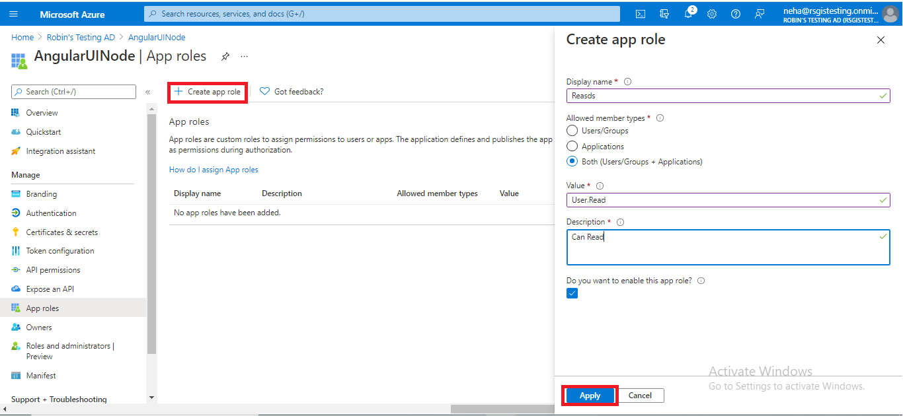
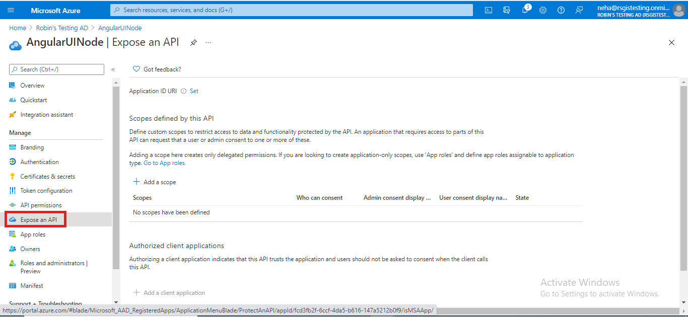

# Developing React UI with Azure AD authentication (using MSAL) communicating with NodeJS back end

  This sample shows you how to create a univseral authentication with Azure. The token is then used by the auth interceptor every time it needs to talk to back-end service.
  We are showing capabilities how to talk to multiple back-end services written in different languages that communicate with different Azure services.
  These back-end services are itself REST API complaint services. Source code to those services are available.
   
  Each button in the UI talks to different REST end points.

   1. Products - Communicates with Azure SQL DB using Node.js

   1. Files - Communicates with Azure blob storage using Node.js

   1. School - Communicates with Azure Cosmos DB using Node.js

Link to the working Vue.js UI
https://vuejs-2-nodejs.azurewebsites.net/

# Azure Active Directory (App registration)

This application does external Authentication with Azure AD. Use Azure Active Directory to create App registration. Use the following steps to get app registration details.
## Step 1: Create new app registration

1. In the Azure Portal, select **Azure Active Directory**


&nbsp;

2. Click on the **App registrations** button then click on **New registration**

 
&nbsp;

3. Fill out the **Form** inputs as follows:
- **Name:** Enter a display Name for your application
- Specify who can use the application

## Step 2: Configure platform settings

1. Under Manage, select **Authentication**
2. Under Platform configurations, select **Add a platform**
3. Under Configure platforms, select the **Web platform** for your application

 
&nbsp;

4. Add **redirect URL**, select both **access token** and **ID token**


&nbsp;

5. Click on configure

## Step 3: Add app roles

1. Under Manage, select **App Roles**


&nbsp;

2. Click on **Create app role**


&nbsp;

3. Fill out **Form** inputs as follow:
- **Display name:** for the app role that appears in the admin consent and app assignment experiences
- **Allowed member types:** Specifies whether this app role can be assigned to users, applications, or both
- **Value:** Specifies the value of the roles claim that the application should expect in the token
- **Description** add description
4. Select Apply to save your changes

## Step 4: Add Scopes

1. Under Manage, select **Expose an API**


&nbsp;

2. Click on **Add a scope**


&nbsp;

3. You're prompted to set an **Application ID URI** if you haven't yet configured one


&nbsp;

4. Click on **Save and continue**
5. Next, specify the scope's attributes in the Add a scope pane


&nbsp;

6. Fill out **Form** inputs as follow:
- **Scope name:** The name of your scope. Here you add **access_as_user**
- **Who can consent:** select **Admins and users**
- **Admin consent display name:** A short description of the scope's purpose that only admins will see
- **Admin consent description:** add description

## To Run Locally
1. Clone the repository

      ```bash
      git clone https://github.com/RobinGhoshATL/react-2-nodejs.git
      cd react-2-nodejs 
      ```
2. Create new file with name `.env`
Substitute `REACT_APP_API_URL` with `https://nodejs-be-protected.azurewebsites.net/api/`.

      ```bash
     REACT_APP_API_URL="CHANGE_ME"

      ```   

## Build


In the project directory, you can run:

### `yarn start`

Runs the app in the development mode.<br>
Open [http://localhost:3000](http://localhost:3000) to view it in the browser.

The page will reload if you make edits.<br>
You will also see any lint errors in the console.  CONGRATULATIONS. If you are redirected to Microsoft login page and after login redirect to dashboard page, you have  successfully run this application locally.

### `yarn test`

Launches the test runner in the interactive watch mode.<br>
See the section about [running tests](https://facebook.github.io/create-react-app/docs/running-tests) for more information.

### `yarn run build`

Builds the app for production to the `build` folder.<br>
It correctly bundles React in production mode and optimizes the build for the best performance.

The build is minified and the filenames include the hashes.<br>
Your app is ready to be deployed!

See the section about [deployment](https://facebook.github.io/create-react-app/docs/deployment) for more information.

### `yarn run eject`

**Note: this is a one-way operation. Once you `eject`, you can’t go back!**

If you aren’t satisfied with the build tool and configuration choices, you can `eject` at any time. This command will remove the single build dependency from your project.

Instead, it will copy all the configuration files and the transitive dependencies (Webpack, Babel, ESLint, etc) right into your project so you have full control over them. All of the commands except `eject` will still work, but they will point to the copied scripts so you can tweak them. At this point you’re on your own.

You don’t have to ever use `eject`. The curated feature set is suitable for small and middle deployments, and you shouldn’t feel obligated to use this feature. However we understand that this tool wouldn’t be useful if you couldn’t customize it when you are ready for it.


